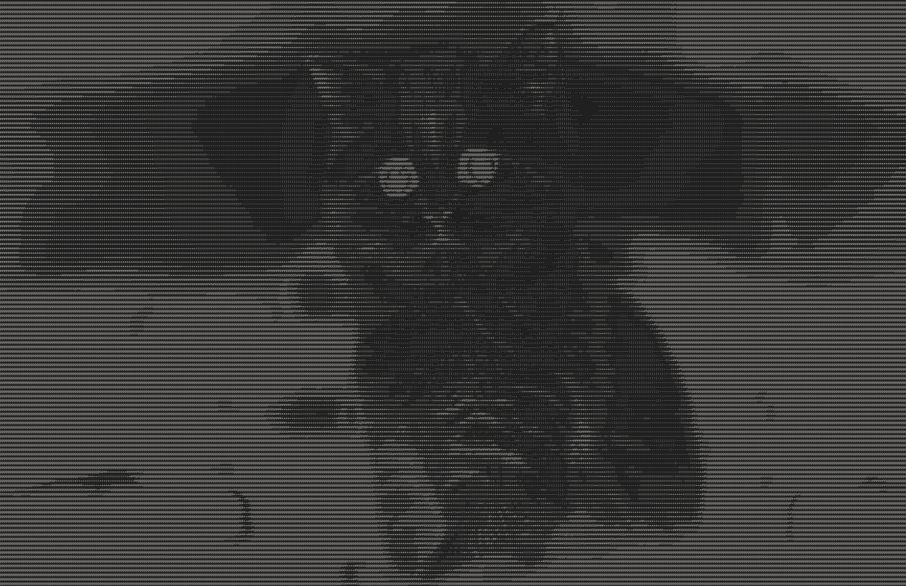

# ASCII Art Maker

This project is an ASCII art maker built using my own C++ library, **Kalam**.
The main objective of this project was to really see how Kalam is working properly and what it can do.

From way back I wanted to create this project, to convert image into ascii using c++.
But I was always failing and finding it hard to do, but I made kalam for simplifying image processing tasks and
finally able to give life to this project in so few lines of code because of Kalam.

## Overview

The ASCII art maker takes an image file as input and converts it into an ASCII representation. This is achieved through a series of steps that involve loading the image, converting it to grayscale, adjusting contrast, and finally mapping pixel brightness to ASCII characters.

### Features

- **Image Loading**: The Kalam library makes it easy to load various image formats with minimal code.
- **Grayscale Conversion**: It uses a weighted sum method to convert RGB values into grayscale values.
- **Contrast Adjustment**: The brightness of the grayscale image can be adjusted to enhance the final ASCII output.
- **ASCII Mapping**: Each brightness value is mapped to a corresponding ASCII character to create the final art.

## Code Structure

The core functionalities are implemented in the following functions:

1. **adjustContrast**: Adjusts the contrast of a given pixel value.
2. **mapToAscii**: Maps a brightness value to an ASCII character based on predefined characters.
3. **rgbToGray**: Converts an RGB image to grayscale while adjusting the contrast.
4. **generateAscii**: Main function that generates ASCII art from the provided image.

## Examples

<table>
  <tr>
    <td align="center">Original Image</td>
    <td align="center">ASCII Art</td>
  </tr>
  <tr>
    <td>
      
    </td>
    <td>
      
    </td>
  </tr>

  <tr>
    <td align="center">Original Image</td>
    <td align="center">ASCII Art</td>
  </tr>
  <tr>
    <td>
      
    </td>
    <td>
      
    </td>
  </tr>
</table>

## Usage

To run the ASCII art maker, follow these steps:

1. **Compile the code:** Ensure that you have the `Kalam library` installed and properly linked in your project.

```bash
g++ main.cpp -o main -lkalam
```

2. **Run the program:** Execute the compiled program by providing an image file and optionally a contrast value.

```bash
./main <image_file> [contrast]
```

- `<image_file>:` Path to the input image. (can take .png or .jpg/jpeg)
- `[contrast]:` Optional contrast value (default is 1.5).

## Conclusion

Using my Kalam library for this project has made working with images significantly easier. Its intuitive API allows for quick implementation of complex image processing tasks without the overhead of managing low-level details. This ASCII art generator is just one of many possibilities, and I look forward to exploring more features of Kalam in future projects!

## License

This project is licensed under the MIT License.
